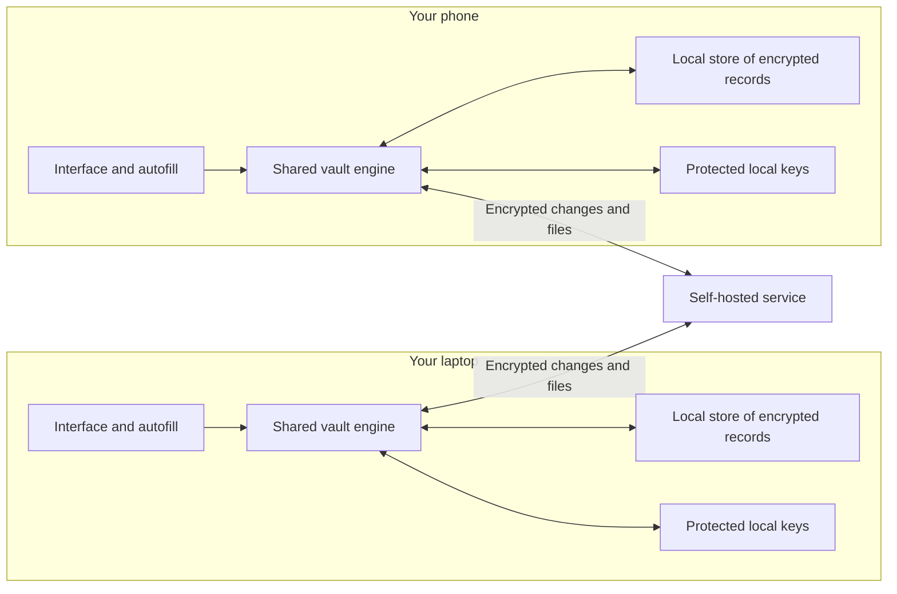

# mypassman: proposed architecture

2026-10-04. Design proposal based on [the product brief](PRODUCT-BRIEF.md)
and the legacy repository at `b66f308` plus uncommitted work, now preserved
on the [archive branch](LEGACY-REFERENCE.md). This describes
recommended behavior and boundaries. It is not an implemented system, an
approved wire format, or a security audit. Rust for the shared core was
explicitly chosen on 2026-10-04; the remaining technology choices below are
recommendations to validate.

## Governing rule: simplicity within the security requirements

The maintainer explicitly prioritized simplicity across the whole system on
2026-10-04. Evaluate the proposal by how easily someone can understand normal
operation, failure, and recovery, as well as its resource use.

- Prefer a few well-defined components and one shared implementation of each
  security rule. Add platform or hosting adapters for demonstrated needs.
- Use established libraries for cryptography and durable storage. Evaluate
  dependencies by the maintenance and custom code they replace; minimizing
  dependency count alone is not the objective.
- Build one complete path before adding deployment modes, settings, or
  generalized extension machinery. Keep the required platforms and future
  sharing model in view without implementing unused frameworks for them.
- Justify optimizations with measurements and account for their recovery
  complexity. Prefer understandable state transitions and bounded work.
- Preserve encryption, authentication, authorization, signature checks,
  tamper detection, and explicit recovery behavior. Simplification must not
  remove a protection required by the threat model or silently lose data.

For each substantial addition, record the user need, why existing components
cannot meet it simply, and how it behaves when interrupted. When the cost is
too high, narrow or stage the feature. Simplicity supports reviewability;
security claims still require evidence and testing.

## Development discipline: keep the codebase under control

The maintainer explicitly requires purposeful code, sound architecture, and
continued understanding of the codebase. Apply these rules to each increment:

1. Define one user-visible outcome or one necessary internal change, the
   affected components, and a concrete completion check. Keep unrelated
   cleanup separate and leave each increment in a reviewable state.
2. Give each component a clear responsibility and each durable state change
   an explicit owner and commit boundary. Keep UI and host adapters thin;
   avoid duplicating security and business rules across them.
3. Introduce abstractions, dependencies, and configuration for demonstrated
   needs. Prefer direct code and explicit types; remove replaced paths and
   temporary scaffolding when their migration purpose ends. Comments explain
   non-obvious decisions and invariants instead of narrating syntax.
4. Explain changes to trust boundaries, formats, or component responsibilities
   before implementation. Record consequential decisions briefly with their
   reasons. Keep one current design and one active implementation plan; mark
   older proposals historical and update existing documents rather than
   generating overlapping plans.
5. Verify behavior at meaningful boundaries: use security and recovery cases
   for those changes, performance measurements for efficiency claims, and
   the repository's required checks. Distinguish what was tested from what
   is still assumed. A passing test suite does not establish a security audit.
6. When fixes repeatedly add exceptions around the same behavior, reassess
   its state model and ownership before expanding the patch. Treat difficulty
   explaining a change as a reason to simplify or split it.

Report each increment in plain language: what changed, why it belongs in that
component, what was verified, and what remains uncertain. The maintainer should
be able to locate a feature's logic and explain its normal and failure paths
without reconstructing an agent conversation. Keep documentation proportional
to the decision so the process remains lightweight too.

## The system in one picture

Every device keeps a usable local vault. A shared engine handles vault
rules. Platform interfaces handle interaction and autofill. The hosting
service exchanges encrypted changes and files between authorized devices.

The service holds ciphertext, public verification material, and access
metadata. It can observe connection addresses, sizes, timing, and some
relationships between devices and vaults. Vault names, item titles, URLs,
fields, and attachment names stay encrypted. Clients verify received data.
The service can interrupt availability; local access continues for content
already present on the device.

## Recommended building blocks

| Part | Responsibility | Proposed starting point |
| --- | --- | --- |
| Vault engine | Items, cryptographic validation, permissions, merge rules, sync decisions | Rust library shared across clients (chosen) |
| Local storage | Encrypted records, verified history, pending work, sync progress | SQLite on native platforms; transactional browser storage adapter |
| Platform layer | UI, autofill, clipboard, protected keys, app lifecycle | Small platform-specific integrations; toolkits selected after measurements |
| Hosting service | Authenticate access, validate submissions, store and deliver encrypted content | Cloudflare first, with a portable self-hosted host as a target |
| Optional organization features | Membership management, policies, identity-provider sign-in | Extend the same vault access model |

Rust is the selected core language. Keep its implementation direct and its
development builds incremental. Measure clean compilation separately from
editing one function and running the relevant tests. Keep UI dependencies
outside the core and avoid rebuilding unrelated targets in the daily loop.
The archived release profile uses fat LTO and one code-generation unit;
those settings affect release builds and do not establish the cause of slow
development builds. Reassess expensive optimization settings using build,
runtime, and size measurements. No compilation-time budget is validated yet.

## Platform technology recommendations

Aim for four graphical UI families: Apple, Android, Windows/Linux, and web/extensions.
Share vault behavior in Rust and appropriate UI components within each family.
The maintainer requires beautiful, fast clients with the closest practical
fit to each platform's appearance and behavior. Grouping platforms is
conditional on meeting that standard. These choices add real packaging and
integration work, so the platform layers need small interfaces and
representative tests too.

| Platform | Recommended technology | Connection to the core |
| --- | --- | --- |
| iOS/iPadOS and macOS | Swift + SwiftUI; platform-specific autofill and app integration | Native Rust library through UniFFI |
| Android | Kotlin + Jetpack Compose; Autofill service and credential-provider integration as supported | Native Rust library through UniFFI |
| Windows and Linux | Rust; evaluate GPUI and Slint before selecting the UI toolkit | Direct Rust calls; OS-specific key storage and integration |
| Web vault | TypeScript + Vite; UI framework remains open | Rust compiled to WebAssembly, using wasm-bindgen |
| Browser extensions | WebExtensions APIs + components shared with the selected web UI | Packaged Rust/Wasm; browser-specific manifests, lifecycle, and Safari packaging |
| CLI and optional terminal UI | Rust + clap for command parsing; Ratatui proposed for interactive screens | Direct Rust calls to the same core |
| Raycast | Existing TypeScript/React integration, adapted only as needed | Narrow CLI or local service interface |

[SwiftUI](https://developer.apple.com/swiftui/) supports Apple-platform UI
sharing. [Jetpack Compose](https://developer.android.com/compose) is Android's
modern native UI toolkit. [UniFFI](https://mozilla.github.io/uniffi-rs/latest/)
generates Swift and Kotlin bindings, but does not supply end-to-end platform
packaging. Test one unlock and autofill path through each native bridge early.

The maintainer raised GPUI as an alternative to Slint on 2026-10-04; neither
is selected. [GPUI](https://gpui.rs/) offers GPU-accelerated UI authored in Rust.
Its [README](https://github.com/zed-industries/zed/blob/main/crates/gpui/README.md)
describes desktop platform backends and explicitly warns that it is pre-1.0
with frequent breaking changes. Include upgrade work and clean/incremental
compilation time in its evaluation. GPU acceleration alone establishes neither
low idle resource use nor native control behavior.

[Slint](https://docs.slint.dev/latest/docs/slint/guide/backends-and-renderers/backends_and_renderers/)
remains an alternative with desktop renderers and Rust integration. Its
[viewer](https://docs.slint.dev/latest/docs/slint/guide/tooling/slint-viewer/)
supports live UI preview. Evaluate both candidates with representative unlock,
list, and edit screens: screen readers, keyboard navigation, international text
input, password fields, window/tray behavior, native visual fit, packaging,
startup, and idle resource use. If meeting platform expectations requires too
much custom control behavior, reassess separate platform UI toolkits and their
maintenance cost before committing to the shared UI.

Clap and Ratatui serve complementary purposes. Ratatui's own
[CLI argument recipe](https://ratatui.rs/recipes/apps/cli-arguments/) uses clap.
If an interactive terminal client is chosen, propose `mypassman tui` alongside
ordinary commands for automation and integrations. Keep terminal presentation
separate from vault rules, and redraw on relevant events or visible timed
changes rather than running a continuous idle render loop. The terminal UI is
a candidate, not an approved implementation milestone.

### Client experience requirements

Keep terminology, item structure, and product identity consistent. Adapt
navigation, window layout, menus, dialogs, typography, spacing, focus behavior,
and keyboard/touch interactions to the target platform. Account for the
chosen Linux desktop environments rather than assuming one universal look.
Prefer platform controls when they meet the product's needs; custom components
need a concrete reason and equivalent accessibility and interaction behavior.

Review representative unlock, search/list, item editing, and attachment flows
before expanding the UI. Include light/dark appearance, text scaling, keyboard
navigation, and assistive technology. Use restrained motion that respects
reduced-motion settings. Evaluate visual polish and measured startup, input,
scrolling, idle CPU, and memory together. Avoid continuous animation or
unnecessary redraws while idle. Native appearance alone does not demonstrate
good performance, and low memory use alone does not demonstrate a good client.

### Web and hosting integration

The web UI framework remains open following the maintainer's reservations
about Svelte on 2026-10-04. [Svelte](https://svelte.dev/docs/svelte/overview)
remains a candidate; choose based on maintainable components, accessible UI,
measured bundle/runtime cost, and the maintainer's ability to understand the
code. Share appropriate components between the web vault and extensions. Use
[wasm-bindgen](https://wasm-bindgen.github.io/wasm-bindgen/) for the
Rust/JavaScript boundary. The browser needs transactional local
storage such as IndexedDB instead of assuming native SQLite bindings work
unchanged. Keep platform I/O out of the portable core. Validate randomness,
unlock cost, browser storage, background suspension, and extension policies.
For example, Chrome requires an explicit
[extension CSP allowing packaged Wasm](https://developer.chrome.com/docs/extensions/reference/manifest/content-security-policy).

Rendering and autofill necessarily expose selected plaintext outside Rust.
Keep those transfers narrow, avoid whole-vault plaintext UI state and logs,
and define lock behavior across language and process boundaries. Rust/Wasm
does not make the browser environment a protected secret store.

For hosting, recommend a shared Rust relay rules library with two small host
adapters as the eventual target: an Axum + SQLite native binary, and a
Cloudflare Worker using Rust/Wasm with Durable Objects storage. Implement one
hosting path for the first usable increment; Cloudflare remains the proposed
first deployment. A small portability experiment does not require shipping or
maintaining both adapters immediately. Cloudflare's
[workers-rs support](https://developers.cloudflare.com/workers/languages/rust/)
makes the latter a candidate, not proof that our native dependencies or
transaction model are portable unchanged. Validate the adapter with a real
protocol operation and shared contract tests. Attachment storage remains an
explicit hosting decision. Keep decryption keys entirely on clients.

Arrange builds so UI-only changes reuse the compiled Rust core. Keep browser
UI iteration independent from Wasm recompilation when the core has not changed.
Measure the actual integrated edit/test loop before selecting additional build
tooling or claiming that this layout solves compilation latency.

Cloudflare-first is a proposed delivery order, not a platform lock-in.
Keep protocol decisions shared and host adapters narrow. Prove portability
before promising one implementation runs unchanged on both hosts. The current
[free tier supports SQLite-backed Durable Objects](https://developers.cloudflare.com/durable-objects/platform/pricing/),
subject to usage limits. Attachment storage and realistic CPU/request costs
must be measured before selecting a full hosting package.

## What a vault contains and who can open it

- A **person** can own personal vaults and join shared vaults.
- A **device** is an authorized installation with its own identity.
- A **vault** groups items under an independent encryption key and an
  authenticated access policy.
- An **item** is a structured encrypted record: login, card, API key, note,
  identity, or another supported type. Custom fields allow extension.
- An **attachment** is encrypted file content referenced by an item.

A master password protects the person's local key material. That material
provides access to their vault keys. A separate recovery secret provides a
second route to recover that material. Biometric unlock, where supported,
uses an OS-protected local key after the OS authorizes access. The server
receives none of those secrets in plaintext.

Separate permission to decrypt, permission to write, and permission to manage
membership. A reader must not inherit an administrator's signing secret.
This is a change from the current
[`KeyBundle` on the archive branch](LEGACY-REFERENCE.md), which combines vault decryption
keys and owner signing authority. Its exact format cannot simply become the
shared-vault model.

Keep existing cryptographic primitives, signature checks, and domain
separation intact. The recipient key-delivery and membership formats remain
design work requiring review; this overview does not invent a new encryption
protocol or authorize a cryptographic change.

## Compatibility across client versions

Clients will update at different times. Before freezing a durable format,
define record versions, supported operations, and behavior for unknown fields
and item types. An older client must never silently discard content when
editing and signing a new revision. Preserve unknown data losslessly where
the operation is understood; make unsupported items read-only or require an
upgrade when their semantics cannot be handled safely. A generic display is
useful only where the client can interpret it safely.

Test round trips between older and newer clients, including edits to items
with additional fields. Unknown security or permission semantics must never
be treated as optional just because unknown display fields can be preserved.

## Everyday behavior, including interruptions

### Save a password or card, then reopen offline

The engine encrypts the new revision and records it, the updated local view,
and pending sync work in one local transaction. Show "saved on this device"
after a durable commit; show "synced" only after the service acknowledges it.
An interrupted upload can be retried using the same revision identity.

SQLite supplies transaction atomicity under its documented storage
assumptions; multiple writes in one transaction commit together. This is the
basis for consolidating today's separate state files.
See [SQLite atomic commit](https://www.sqlite.org/atomiccommit.html).

All processes use the same storage interface, with serialized write
transactions. This does not require a permanent daemon. SQLite, network
requests, OS key storage, and attachment files cannot share one transaction;
operations crossing those boundaries need explicit persisted stages and
retry rules. Plaintext fields never enter database tables, journals, or
persistent search indexes. Browser adapters must meet equivalent observable
transaction behavior.

### Edit the same item on two offline devices

Each device saves its own authenticated revision. At reconnection, the
engine detects competing edits and retains both. Recommend a deterministic
display choice plus a visible conflict that the user can resolve. Concurrent
delete-versus-edit should also retain a recoverable conflicting revision.
Exact ordering and conflict representation must be specified and tested.

Record sync progress in the same transaction that accepts incoming changes.
If interrupted, replaying a batch has the same result as accepting it once.
Keep authenticated history initially, with cached current state for routine
reads. Storage still grows: measure it and design explicit retention later,
including what deletion means for copies and backups. Automatic destructive
history compaction should not be part of the first replacement.

### Add a second device

Authorize it through an existing trusted device or a recovery flow. The new
device receives the appropriate protected key material and an authenticated
trust anchor, then downloads and verifies vault content. Interrupted pairing
must resume safely without losing the only credentials needed to finish.

Signatures establish authenticity, not that the server supplied the newest
state. Remember verified history and permission checkpoints, reject known
rollback, and surface competing valid histories. A fresh device needs a
trusted starting checkpoint. A server hiding unseen updates cannot always
be detected; enrollment and restore must explain the freshness they establish.
The exact history protocol remains open.

### Attach a document and restore it later

Encrypt and authenticate files in bounded chunks, with encrypted metadata
that binds the expected complete file, chunk order, and length. Keep file
content outside the ordinary item list so a large attachment does not require
loading it into memory. The chunk format needs its own reviewed specification.

Stage content durably before committing a local ready reference; upload chunks
before declaring an attachment available remotely. Retry interrupted work
and track missing content explicitly. Default to downloading attachments on
demand, with a "keep offline" option. A complete backup must fetch and verify
every referenced attachment, or clearly report that it is incomplete.

### Lose a device or forget the password

A surviving authorized device or recovery secret can provide a recovery
route, provided the required encrypted data and key envelopes still exist.
A recovery secret is not a backup. No password, authorized device, or recovery
secret means the personal vault cannot be decrypted; a server-side account
reset alone cannot restore access.

Recovery onto replacement hardware creates a fresh device identity. Backups
must capture a consistent encrypted dataset, attachment inventory, and the
key material needed for recovery. Demonstrate restoration with the old device
and relay unavailable, then test safe reconnection without reusing an old
device's write sequence.

### Share a vault, remove a member, or use SSO

Grant members access to that vault's keys according to an authenticated policy.
Do not distribute a personal master password. Removing a member withdraws
service access and rotates keys for future content as authorized clients learn
the change. Define how offline writes using obsolete permissions are handled.
Previously obtained secrets and downloaded files cannot be taken back.

Recommend starting organizational SSO as identity verification for service
access, with a separate vault-unlock step. SSO-only unlock is a distinct future
design involving trusted devices or explicit organization recovery authority.
An organization administrator should gain decryption authority only through
an explicit, understood policy. Keep personal vault recovery independent.

## What makes it lightweight

Decrypt requested secrets and bounded lists on demand. Bound unlocked search
and list caches, and discard them on lock. Avoid work proportional to total
history on each read. Sync on edits, app use, or appropriate platform events;
use bounded retries with backoff. Avoid continuous scanning or tight polling.

Use an unlock helper only when integrations need a shared session. Let it
exit on lock where the platform allows. Measure the whole app and helper,
including UI and bindings. Unlock's deliberate password-derivation cost has
a separate budget from idle CPU and memory. No specific memory number or
zero-background-work claim is validated yet.

A web app also needs trusted delivery: a compromised host serving the client
can replace its code and capture secrets at unlock. Compiling the core to
WebAssembly does not remove this boundary. Document it separately from the
blind data service and review client distribution on every platform.

## First implementation boundary and how to evaluate it

First agree on a concise state model for revisions, authorization, key
envelopes, recovery, and checkpoints before designing a replacement durable
schema. Prove its critical transitions with two headless device instances,
separate local databases, and one relay implementation. Exercise enrollment,
divergent offline edits, interrupted replay, known rollback, and revocation.
Conflict detection must account for revision ancestry, including branches
with multiple edits; sharing an immediate parent is not a complete rule.

Use a macOS development client and small mobile/browser compatibility
experiments to test the platform boundaries before committing to UI
frameworks. Choose the second usable client from actual daily use and
experiment results. All named platforms remain product targets.

The first complete increment should demonstrate two devices with a personal
vault containing a login, card, API key, and attachment. Save offline, sync,
resolve a concurrent edit, lock, recover, and restore a complete backup. Test
interruption during saves, uploads, pairing, and restore; reject tampering and
known rollback. Measure memory, idle CPU, unlock time, sync costs, and storage
growth on a declared dataset and target hardware. Use those measurements to
set enforceable resource budgets before expanding the interface.

Reuse candidates include crypto wrappers, item fields, TOTP/generation, and
behavioral tests. Treat the existing persistence, sync orchestration, and
combined owner/decryption key bundle as redesign candidates. This assessment
is structural, not a correctness verdict. Existing plans 016–019 contain
related ideas; their compatibility and migration constraints need reassessment.

## Choices still requiring resolution

Resolve these before freezing the first durable format and sync contract:

- Revision identity, ancestry, conflict representation, replay, and trusted
  checkpoints; distinguish transport cursors from authenticated history.
- People, devices, key envelopes, write/admin authority, enrollment, recovery,
  and offline revocation. Personal multi-device use already needs device
  authorization; organization UI can follow later.
- Version compatibility, including preservation of unknown fields and when an
  older client must refuse to write. Measure password-derivation cost on target
  hardware before choosing format defaults and an upgrade policy.
- First hosting path and attachment storage, with explicit limits for the first
  supported workload. Recommend relay-first sync with portable backups; defer
  the folder-sync fallback and second production host.
- Existing-vault migration requirements. Assume preservation is required until
  the maintainer says otherwise; import into a new copy rather than overwrite
  the only existing vault.

Choose representative hardware and the first daily-use clients for the initial
experiments. Set numerical performance budgets from those measurements.
Desktop/web toolkit selection, TUI, organization UI, SSO-only unlock, and
destructive history retention can wait for their own implementation phases.
These deferrals change delivery order, not the product's platform coverage.

The next deliverable from this proposal is a small measured feasibility
experiment and a precise state model, scoped to those choices. Freeze format
or protocol changes only after their security behavior and recovery cases
have been reviewed and recorded alongside the normative specifications.
